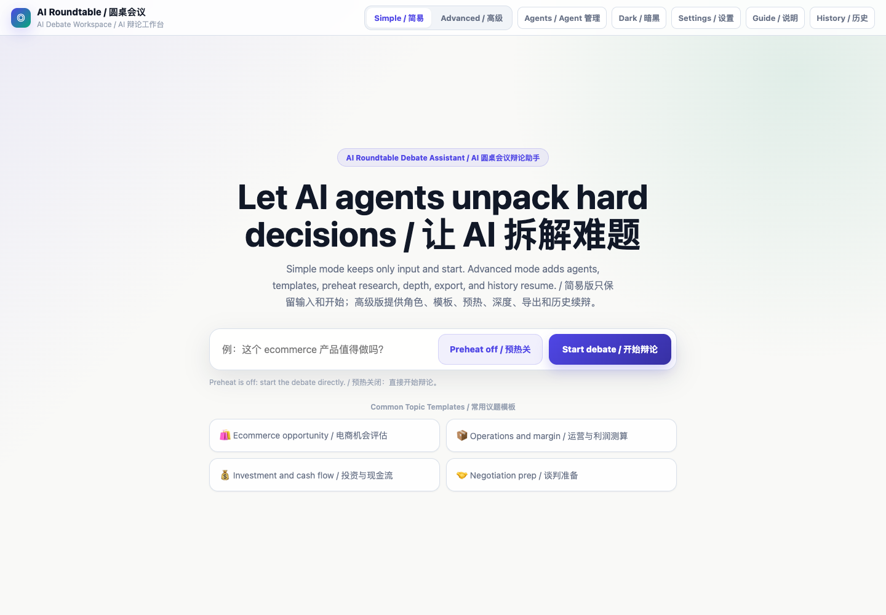
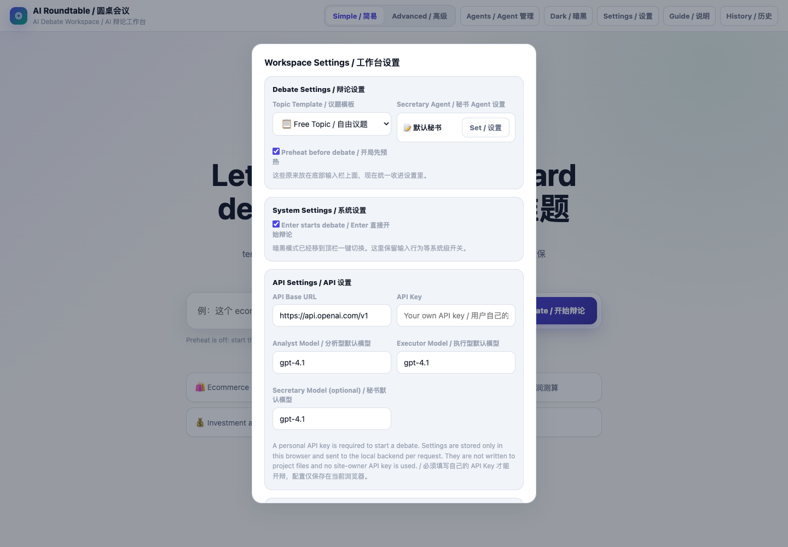
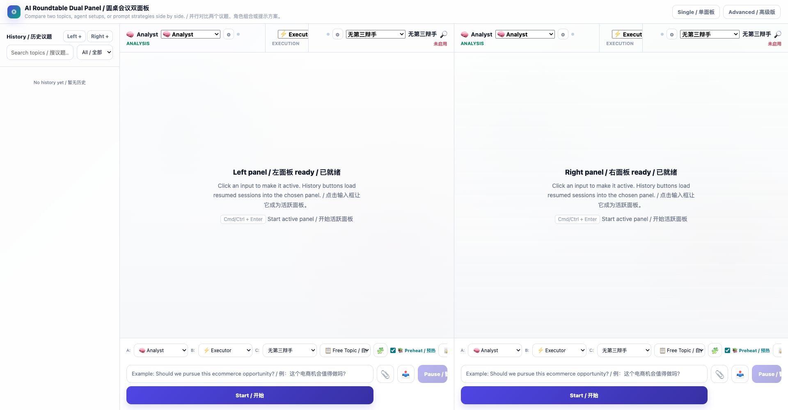

# Yuanzhuo AI Roundtable

[](https://github.com/bbinapple/yuanzhuo-ai-roundtable/actions/workflows/check.yml)
[](https://github.com/bbinapple/yuanzhuo-ai-roundtable/releases)
[](LICENSE)

Yuanzhuo turns one messy question into a structured multi-agent roundtable, then exports decisions, action items, scores, tags, and summaries. It is local-first, BYOK-first, and built around OpenAI-compatible chat completion APIs.

> 中文摘要：Yuanzhuo AI Roundtable 是一个通用多 Agent 圆桌决策工作台。用户输入议题，多个 Agent 从不同角度讨论，最后生成总结、待办、标签、评分和 Markdown 导出。项目默认不内置服务方 API Key，用户在浏览器里填写自己的 OpenAI-compatible API 配置。



## Why Yuanzhuo?

Many AI tools produce a single answer. Yuanzhuo is designed for questions where a single answer is not enough: product tradeoffs, project reviews, meeting follow-ups, negotiation prep, and operational decisions that need several perspectives before a human decides.

Yuanzhuo helps you:

- compare multiple agent viewpoints in one session
- pause for user input when the debate needs missing context
- convert a discussion into todos, tags, scores, and a Markdown export
- run locally without a maintainer-owned API key

Good use cases:

- product and feature decision review
- meeting summary and action-item extraction
- side project or startup idea review
- ecommerce product opportunity review with sanitized public examples
- negotiation prep and scenario planning

Yuanzhuo is not an autonomous decision maker and does not guarantee business, financial, legal, or medical outcomes.

## Features

- Multi-agent debate with two required roles and an optional third role.
- Built-in analyst, executor, investor, user advocate, mentor, moderator, and researcher roles.
- BYOK model settings through the browser UI.
- Topic templates for free discussion, SWOT decisions, negotiation prep, side project review, and ecommerce opportunity review.
- Optional pre-discussion research stage. Review tool access before enabling it in shared deployments.
- Streaming web UI with pause, user interjection, snapshots, summaries, todos, tags, scores, and Markdown export.
- Local-first FastAPI server with OpenAI-compatible model endpoints.

## Quick Start

### Python

```bash
cd yuanzhuo-ai-roundtable
python3 -m venv .venv
source .venv/bin/activate
pip install -r requirements.txt
python3 server.py
```

Open the URL printed by the server, usually:

```text
http://127.0.0.1:8888/
```

### Docker

```bash
docker compose up --build
```

Then open:

```text
http://127.0.0.1:8888/
```

Run the local checks:

```bash
bash scripts/check.sh
```

Expected output:

```text
== Python syntax ==
python ast ok
== JavaScript syntax ==
== HTTP smoke on 127.0.0.1:<port> ==
All checks passed.
```

## Screenshots

The screenshots below use an empty local history and no real API key.

### BYOK API settings



### Dual-panel comparison workspace



## BYOK API Settings

Yuanzhuo does not require the project maintainer to provide a shared model key. Each user can open `Settings -> API Settings` in the web UI and enter:

- `API Base URL`, for example `https://api.openai.com/v1`
- `API Key`, provided by the user
- default analyst model
- default executor model
- optional summary model

The browser stores these settings in localStorage. They are sent to the local server only when a roundtable run starts. The project does not write user API keys to repository files.

For public deployment, use HTTPS and review your own data-handling obligations before allowing users to enter provider credentials.

## Web UI

- `/` - primary single-panel roundtable workspace
- `/dual` - two-panel comparison workspace
- `/simple` - compatibility entry that reuses the main workspace

## API Surface

- `GET /api/health`
- `POST /api/models`
- `GET /api/roles`
- `POST /api/round`
- `GET /api/stream/{session_id}`
- `POST /api/respond/{session_id}`
- `GET /api/export/{session_id}`

## Architecture

```text
Browser UI
  -> FastAPI server
    -> role and template loader
    -> OpenAI-compatible chat completions
    -> optional tool calls for research
    -> SSE streaming events
    -> summary, todos, tags, scores, Markdown export
```

Core files:

- `server.py` - FastAPI app, streaming debate orchestration, export endpoints
- `cli.py` - command-line interface for local roundtable sessions
- `roles/` - built-in role prompts with frontmatter metadata
- `templates/` - topic templates
- `public/` - browser UI
- `scripts/check.sh` - syntax and HTTP smoke checks

More docs:

- [Configuration](docs/CONFIGURATION.md)
- [Privacy](docs/PRIVACY.md)
- [Deployment](docs/DEPLOYMENT.md)
- [Example outputs](examples/)
- [v0.1.0 Release Notes](docs/release/v0.1.0.md)
- [Starter GitHub Issues](docs/GITHUB_ISSUES_TO_CREATE.md)

## Safety And Privacy Notes

- Yuanzhuo is a decision-support tool, not an autonomous decision maker.
- The example templates do not provide financial, legal, medical, or business-result guarantees.
- Users remain responsible for checking model output and making final decisions.
- Do not commit `.env`, provider credentials, private meeting notes, customer data, or generated histories.
- The default `.gitignore` excludes local environment files, cache files, session exports, and agent workspace metadata.
- Tool features can fetch web pages. The `read_local` model tool is disabled by default; enable it only on a trusted local machine. Review `tools.py` before deploying Yuanzhuo beyond a trusted local environment.

## Roadmap

| Area | Status | Issue |
|---|---|---|
| Docker packaging | Planned | [#1](https://github.com/bbinapple/yuanzhuo-ai-roundtable/issues/1) |
| Provider presets | Planned | [#2](https://github.com/bbinapple/yuanzhuo-ai-roundtable/issues/2) |
| Streaming regression tests | Planned | [#3](https://github.com/bbinapple/yuanzhuo-ai-roundtable/issues/3) |
| i18n coverage | Planned | [#4](https://github.com/bbinapple/yuanzhuo-ai-roundtable/issues/4) |
| Tool permission UX | Planned | [#5](https://github.com/bbinapple/yuanzhuo-ai-roundtable/issues/5) |
| More example workflows | Planned | [#6](https://github.com/bbinapple/yuanzhuo-ai-roundtable/issues/6) |
| Export formats beyond Markdown | Planned | [#7](https://github.com/bbinapple/yuanzhuo-ai-roundtable/issues/7) |

## Maintainer Use Of Codex

This repository is a good fit for AI-assisted OSS maintenance workflows:

- pull request review for prompt, privacy, and tool-access changes
- regression tests for streaming sessions and BYOK validation
- release checklist generation and changelog drafting
- documentation review for local-first and shared-deployment safety
- issue triage for provider presets, template packs, and export formats

## Contributing

Contributions are welcome. Please read [CONTRIBUTING.md](CONTRIBUTING.md) before opening a pull request.

## Security

Please report security issues privately. See [SECURITY.md](SECURITY.md).

## License

MIT. See [LICENSE](LICENSE).
